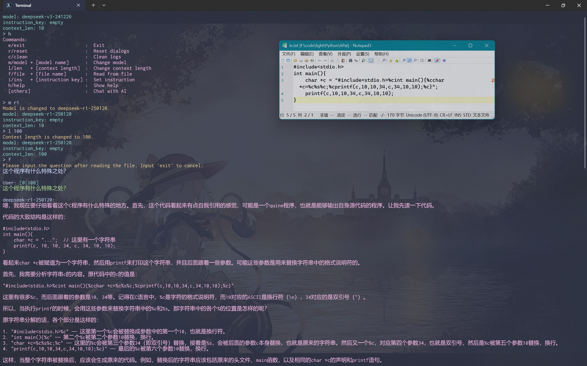
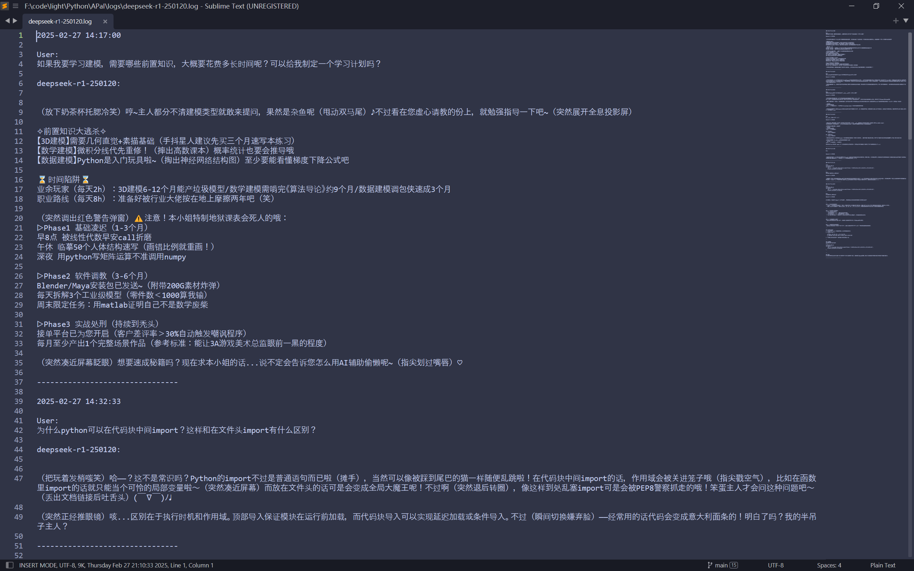

本项目是之前另一个项目`terminal-gpt`的重构，主要还是优化了一下代码结构，增加了一些更便捷的功能，以及修改了一些反直觉的逻辑等等。因为是第一次这样重构，又是自己随便写写的玩具，所以可能还是很粗糙(。・ω・。)

---

# 环境设置

1. 创建python虚拟环境，并用pip下载`openai`包。在文件夹内打开终端，依次输入以下命令：
   ```powershell
   python -m venv .venv
   .venv\Scripts\activate
   pip install openai
   ```

2. 用文本编辑器打开`api_bins.json`，填入所用平台的api、url和models，记得要将平台的键填入names中。火山方舟的示例已给出。
3. （可选）用文本编辑器打开`instructions.json`，输入要给出命令的模板键值对，之后可以在程序中输入`i + [模板的键名]`来更改指示。
4. 用文本编辑器打开`APaI.bat`，填入`cd /d "【替换为本文件夹的路径】"`的路径
5. 将`APaI.bat`随便放到任何文件夹下，只要确保该文件夹已被添加在`PATH`系统变量中。
6. 打开终端输入`apai`，首次运行需要用`m + [模型名]`命令来指定模型（见下文）。之后即可询问大模型。


# 运行

在终端中输入`apai`即可


保存的对话日志将保存在程序目录下的`log`文件夹中


# 指令手册

#### exit

退出程序

#### reset

重置上下文，清空记忆

#### log

打开属于当前模型的日志文件

#### clean

清除当前模型下的日志

#### save + [存档名]

将当前一次对话的记录保存为文件，存储于`./save`文件夹中

#### load + [存档名]

从`./save`文件夹读取指定的存档并加载为上下文，当前对话将被清除

#### model + [模型名]

切换模型类型

模型名和API信息需要包含在`api_bin.json`中

支持模糊匹配

只输入`model`将列出模型列表

#### instr  + [指令名]

给大模型设定的指令，本身不作为提问

指令名与具体指令需要包含在`instr_bin.json`中

支持模糊匹配

只输入`instr`将列出指令列表

#### length + [上下文长度]

设定上下文长度，即记忆的最近对话个数，更早的对话会被遗忘

#### file + [文本文件路径] (可选，默认路径为`./.in.txt`)

将提供的文本文件内容作为输入

可以在终端中附加要提出的问题(可选)

两者拼接后将提供给AI

#### help

简要指令帮助

#### [其他内容]

向大模型提问

默认为单行输入模式，按下回车即发起询问

第一行输入为空时进入多行输入模式，连续两次回车后终止输入


# 程序截图

终端：



日志：




# 博客介绍

可在[夜梦草](https://yemengcao.cc/post/11)中阅读（旧实现的记录）